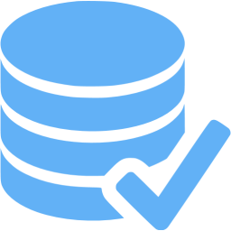

=============================
Django Test Query Counter
=============================

.. image:: https://badge.fury.io/py/django-test-query-counter.svg
    :target: https://badge.fury.io/py/django-test-query-counter

.. image:: https://travis-ci.org/sophilabs/django-test-query-counter.svg?branch=master
    :target: https://travis-ci.org/sophilabs/django-test-query-counter

.. image:: https://codecov.io/gh/sophilabs/django-test-query-counter/branch/master/graph/badge.svg
    :target: https://codecov.io/gh/sophilabs/django-test-query-counter

A Django Toolkit for controlling Query count when testing. It controls the
number of queries done in the tests stays below a particular threshold between
Test Runs.Specially useful when paired with a CI like Jenkins or Travis to
control each commit doesn't slow down the Database considerably.

Requirements
------------

* Python 3
* Django

Documentation
-------------

The full documentation is at https://django-test-query-counter.readthedocs.io.

Installation
-------------

There are ways to install it into your project

Clone this repository into your project:

.. code-block:: bash

    git clone https://github.com/sophilabs/django-test-query-counter.git

Download the zip file and unpack it:

.. code-block:: bash

    wget https://github.com/sophilabs/django-test-query-counter/archive/master.zip
    unzip master.zip

Install with pip:

.. code-block:: bash

    pip install django-test-query-counter

Add it to your `INSTALLED_APPS`:

.. code-block:: python

    INSTALLED_APPS = (
        ...
        'test_query_count',
        ...
    )

Usage
-----

Run your django tests as you do. After the run the
``reports`` directory with two files ``query_count.json`` and
``query_count_detail.json``.

To check your tests Query Counts run:

``$ python manage.py check_query_count``

Then you would see an output like the following one (if you at least ran the
tests twice):

.. code-block::

    All Tests API Queries are below the allowed threshold.

If the current test run had more queries than the last one, it will tell you:

.. code-block::

    There are test cases with API calls that exceeded threshold:

        In test case app.organizations.tests.api.test_division_api.DivisionViewTest.test_bulk_create_division, POST /api/divisions. Expected at most 11 queries but got 15 queries
        In test case app.shipments.tests.api.test_leg_api.LegViewTest.test_create_bulk_leg, POST /api/legs. Expected at most 59 queries but got 62 queries
        In test case app.plans.tests.functional.test_plan_api.PlannedDatesTest.test_unassign_and_assign_driver_to_leg, POST /api/assignments/assign-driver. Expected at most 261 queries but got 402 queries
    CommandError: There was at least one test with an API call excedding the allowed threshold.

Configuration
-------------

You can customize how the Test Query Count works by defining ``TEST_QUERY_COUNTER``
in your settings file as a dictionary. The following code shows an example

.. code-block:: python

    TEST_QUERY_COUNTER = {
        # Global switch
        'ENABLE': True,

        # Paths where the count files are generated (relative to the current
        # process dir)
        'DETAIL_PATH': 'reports/query_count_detail.json',
        'SUMMARY_PATH': 'reports/query_count.json',

        # Tolerated percentage of count increase on successive
        # test runs.A value of 0 prevents increasing queries altoghether.
        'INCREASE_THRESHOLD': 10
    }

Excluding Tests
---------------

Individual tests or classes can be excluded for the count using the
``@exclude_query_count`` decorator. For example

.. code-block:: python

        # To exclude all methods in the class
        @exclude_query_count()
        class AllTestExcluded(TestCase):
            def test_foo(self):
                self.client.get('path-1')

            def test_foo(self):
                self.client.get('path-2')

        # To exclude one test only
        class OneMethodExcluded():
            def test_foo(self):
                self.client.get('path-1')

            @exclude_query_count()
            def test_foo(self):
                self.client.get('path-2')

More specifically, ``exclude_query_count`` accept parameters to conditionally
exclude a query count by path, method or count. Where ``path`` the or regex of
the excluded path(s). The ``method`` specifies the regex of the method(s) to
exclude, and ``count`` is minimum number of queries tolerated. Requests with
less or same amount as "count" will be excluded.

For example:

.. code-block:: python

    class Test(TestCase):
        @exclude_query_count(path='url-2')
        def test_exclude_path(self):
            self.client.get('/url-1')
            self.client.post('/url-2')

        @exclude_query_count(method='post')
        def test_exclude_method(self):
            self.client.get('/url-1')
            self.client.post('/url-2')

        @exclude_query_count(count=2)
        def test_exclude_count(self):
            #  succesive urls requests are additive
            for i in range(3):
                self.client.get('/url-1')

Implementing into your CI
-------------------------

Currently the query count works locally. However, it shines when it is
integrated with `Jenkins <https://jenkins.io/>`_, or other CIs. You have to do
this manually:

Requirements

* Jenkins with a Job that build you project.

From now on let's suppose your job is available at ``http://127.0.0.1:8080/job/ZAP_EXAMPLE_JOB/``.

1. `Activate Build Archive`: Go to the job `configuration page <https://wiki.jenkins.io/display/JENKINS/Configure+the+Job>`_ and add the `archive artifacts <https://jenkins.io/doc/pipeline/tour/tests-and-artifacts/>`_ build
   Post-build actions.

    .. image:: archive-artifact.png
       :alt: Jenkins Post Build Action showing an archive artifact example
       :align: center

2. Set ``reports/query_count.json`` in the files to archive path

3. Create a new Django custom Command to run the validation against the
   archived Jenkins file. For example:

    .. code-block:: python

        from urllib.request import urlretrieve
        from django.core.management import BaseCommand, CommandError
        from django.conf import settings
        from test_query_counter.apps import RequestQueryCountConfig
        from test_query_counter.query_count import QueryCountEvaluator

        class Command(BaseCommand):
            JENKINS_QUERY_COUNT = 'https://yourci/job/' \
                                  'yourproject/lastSuccessfulBuild/' \
                                  'artifact/app/reports/query_count.json'

            def handle(self, *args, **options):
                current_file_path = RequestQueryCountConfig.get_setting('SUMMARY_FILE')

                with open(current_file_path) as current_file, \
                        open(urlretrieve(self.JENKINS_QUERY_COUNT)[0]) as last_file:
                    violations = QueryCountEvaluator(10, current_file,last_file).run()

                    if violations:
                        raise CommandError('There was at least one test with an API '
                                           'call excedding the allowed threshold.')

4. Add a build step to run this command:

    .. image:: build-action.png
       :alt: Jenkins Build Action showing the script action
       :align: center

   After that, it will run fine, and the build would fail if any Query count is over the limit.

TODO
----

* Include support for stacktraces in ``query_count_detail.json``.
* Generate an HTML report of executed Queries.
* Make query count configurable
* Include Jenkins support out of the box (using `django_jenkins`)

Running Tests
-------------

Does the code actually work?

.. code-block:: bash

    source <YOURVIRTUALENV>/bin/activate
    (myenv) $ pip install tox
    (myenv) $ tox

License
-------

PySchool is MIT Licensed. Copyright (c) 2017 Sophilabs, Inc.

Credits
-------

.. image:: https://s3.amazonaws.com/sophilabs-assets/logo/logo_300x66.gif
    :target: https://sophilabs.co

This tool is maintained and funded by Sophilabs, Inc. The names and logos for
sophilabs are trademarks of sophilabs, inc.

Tools used in rendering this package:

*  Cookiecutter_
*  `cookiecutter-djangopackage`_

.. _Cookiecutter: https://github.com/audreyr/cookiecutter
.. _`cookiecutter-djangopackage`: https://github.com/pydanny/cookiecutter-djangopackage
